# Concurrent Ticket Reservation System

- [Concurrent Ticket Reservation System](#concurrent-ticket-reservation-system)
  - [Team Members](#team-members)
  - [Introduction](#introduction)
  - [Description](#description)
    - [Event and Ticket Data Structures](#event-and-ticket-data-structures)
      - [Event](#event)
      - [Ticket](#ticket)
    - [Ticket Reservation System](#ticket-reservation-system)
    - [Concurrency Control](#concurrency-control)
      - [Critical Sections](#critical-sections)
      - [Synchronization and Data Consistency](#synchronization-and-data-consistency)
    - [Client Interface](#client-interface)
    - [Server Interface](#server-interface)
    - [Communication Protocol](#communication-protocol)
    - [Fairness and Resource Management](#fairness-and-resource-management)
      - [Fairness](#fairness)
      - [Resource Management](#resource-management)
    - [Logging and Error Handling](#logging-and-error-handling)
      - [Logging](#logging)
      - [Error Handling](#error-handling)
    - [Caching](#caching)
  - [How to Run](#how-to-run)
  - [Results](#results)
  - [Task Division](#task-division)

## Team Members

| Name              | GitHub ID      | Student Number |
| ----------------- | -------------- | -------------- |
| Saman Eslami      | @SamanEN       | 810199375      |
| Pasha Barahimi    | @PashaBarahimi | 810199385      |
| Ali Padyav        | @alumpish      | 810199388      |
| Misagh Mohaghegh  | @MisaghM       | 810199484      |

## Introduction

This project is a concurrent ticket reservation system that allows multiple clients to reserve tickets for events. The system is implemented using a client-server architecture where the server is responsible for managing the events and tickets and the clients can reserve tickets for events.

## Description

The server is responsible for managing the events and tickets concurrently and ensuring that the data is consistent and the resources are shared fairly among the clients.

### Event and Ticket Data Structures

The server maintains the following data structures to manage the events and tickets:

#### Event

The `Event` data structure represents an event that has a unique ID, a name, a datetime, the number of total tickets, and the number of available tickets.

```go
type Event struct {
    ID               string    `json:"id"`
    Name             string    `json:"name"`
    Date             time.Time `json:"date"`
    TotalTickets     int       `json:"totalTickets"`
    AvailableTickets int       `json:"availableTickets"`
}
```

The `ID` field is UUIDv4 generated using the `github.com/google/uuid` package. The `Date` field is a `time.Time` object that represents the datetime of the event. The `TotalTickets` field represents the total number of tickets available for the event, and the `AvailableTickets` field represents the number of tickets that are currently available for reservation. Also, the JSON tags are used to serialize and deserialize the `Event` object to and from JSON.

#### Ticket

The `Ticket` data structure represents a ticket that has a unique ID and an event ID that it belongs to.

```go
type Ticket struct {
    ID      string `json:"id"`
    EventID string `json:"eventId"`
}
```

The `ID` field is UUIDv4 generated using the `github.com/google/uuid` package. The `EventID` field represents the ID of the event that the ticket belongs to. Also, the JSON tags are used to serialize and deserialize the `Ticket` object to and from JSON.

### Ticket Reservation System

The ticket Reservation System is implemented in the `TicketService` struct that has the following methods:

- `CreateEvent`: Creates a new event with the given name, date, and total tickets.
- `ListEvents`: Lists all the events that are available for reservation.
- `BookTickets`: Books the given number of tickets for the event with the given ID.

The `TicketService` struct is implemented as below:

```go
type TicketService struct {
    events  sync.Map
    tickets sync.Map
    mu      sync.RWMutex
    cache   *cache.Cache
}
```

### Concurrency Control

As mentioned earlier, one of the requirements of the system is to support multiple clients concurrently. To achieve this, we need to implement concurrency control mechanisms to ensure that the data is consistent and the resources are shared fairly among the clients.

#### Critical Sections

To ensure that the data is consistent and the resources are shared fairly among the clients, we need to identify the critical sections in the code that need to be protected by locks. In our case, the critical sections is the operation that modify the events tickets which is the `BookTickets` method.

To understand why the `BookTickets` method is a critical section, consider the following scenario:

1. Client A wants to book 2 tickets for event E1.
2. Client B wants to book 3 tickets for event E1.
3. Client A sends a request to the server to book 2 tickets for event E1.
4. Client B sends a request to the server to book 3 tickets for event E1.
5. The server receives the request from client A and starts processing it. It checks if there are enough available tickets for event E1. Let's assume that there are 4 available tickets for event E1.
6. The server receives the request from client B and starts processing it. It checks if there are enough available tickets for event E1. There are 4 available tickets for event E1.
7. The server decrements the available tickets for event E1 by 2 and sets the new value to 2.
8. The server decrements the available tickets for event E1 by 3 and sets the new value to 1 (which is incorrect because there are only 2 available tickets left). This is happened because the goroutine which is processing the request from client B is not aware of the changes made by the goroutine which is processing the request from client A. This is called the "lost update" problem.

We can solve the "lost update" problem by protecting the critical section with a lock. In our case, we can use a mutex to protect the `BookTickets` method. We can use a read-write mutex to allow multiple clients to read the events data concurrently but only one client to write the events data at a time.

#### Synchronization and Data Consistency

For handling the data consistency, first we will use a `sync.Map` to store the events and tickets data. The `sync.Map` is a concurrent map that is safe for concurrent read and write operations. We will use a `sync.RWMutex` to protect the critical sections of the code that modify the events and tickets data.

For the `CreateEvent` method, we will use a write lock to ensure that only one client can create an event at a time. For the `ListEvents` method, we will use a read lock to allow multiple clients to list the events concurrently. For the `BookTickets` method, we will use a write lock to ensure that only one client can book tickets for an event at a time.

The implementation of the `CreateEvent`, `ListEvents`, and `BookTickets` methods is as follows:

```go
func (ts *TicketService) CreateEvent(name string, date time.Time, totalTickets int) (*event.Event, error) {
    id := uuid.New()
    e := &event.Event{
        ID:               id.String(),
        Name:             name,
        Date:             date,
        TotalTickets:     totalTickets,
        AvailableTickets: totalTickets,
    }
    ts.mu.Lock()
    ts.events.Store(e.ID, e)
    ts.mu.Unlock()
    return e, nil
}

func (ts *TicketService) ListEvents() []*event.Event {
    var events []*event.Event
    ts.mu.RLock()

    // handle listing events

    ts.mu.RUnlock()
    log.Infof("Listing %d events", len(events))
    return events
}

func (ts *TicketService) BookTickets(eventID string, numTickets int) ([]string, error) {
    ts.mu.Lock()
    defer ts.mu.Unlock()

    // handle ticket booking
}
```

As we can see, the critical sections of the `CreateEvent`, `ListEvents`, and `BookTickets` methods are protected by a lock to ensure that the data is consistent.

### Client Interface

For providing a user-friendly interface for the clients, we have used the `bubbletea` package to create a terminal-based UI. The interface consists of the following components:

- `ProgressBar`: Shows the progress of the client being loaded.
- `MainMenu`: Shows the main menu with the following options:
  - `Events`: Lists all the events that are available for reservation.
  - `Logs`: Shows the logs of the client.
  - `Quit`: Quits the client.
- `EventList`: Lists all the events that are available for reservation with the following options:
- `TicketSelector`: When the client selects an event, it shows the ticket selector to select the number of tickets to reserve.
- `LogPort`: Shows the logs of the client.
- `LoadSpinner`: Shows the loading spinner when waiting for the server response.

The client interface is implemented using the `bubbletea` package and its components are implemented as `bubbletea.Model` and the following methods:

- `Update`: Updates the model based on the messages received from the update function.
- `View`: Renders the view based on the model.
- `Init`: Initializes the model with the initial state.

The following method shows the top-level client interface:

```go
func loadMainMenu() {
    status := ""
    for {
        log.Info("Loading main menu")
        menuModel := mainmenu.New(mainMenuChoices, status)
        m, err := tea.NewProgram(menuModel, tea.WithAltScreen()).Run()
        if err != nil {
            log.Errorf("Error loading main menu: %v", err)
            return
        }

        menuModel, _ = m.(mainmenu.Model)
        switch menuModel.Choice {
        case events:
            status = loadEvents()
        case logs:
            loadLogs()
            status = ""
        default:
            return
        }
    }
}
```

The `loadMainMenu` function loads the main menu and based on the user's choice, it loads the events or logs or quits the client. The `loadEvents` function loads the events and allows the user to select an event and reserve tickets for it. The implementation of the `loadEvents` function is as follows:

```go
func loadEvents() (status string) {
    // spinner
    events, err := getEvents()

    if err != nil {
        // log
        return
    }
    log.Infof("Loading events list with %d events", len(events))
    // show events list and prompt for event selection

    if id != "" {
        e := findEventByID(events, id)
        tickets := promptForTickets(e)
        if tickets > 0 {
            // spinner
            err = reserveTickets(e, tickets)
            if err != nil {
                // log
            } else {
                // log
            }
        } else {
            // log
        }
    } else {
        // log
    }
    return
}
```

### Server Interface

The server also provides an interface for managing the events. This is also implemented using the `bubbletea` package and the following components:

- `ProgressBar`: Same as the client interface.
- `MainMenu`: Shows the main menu with the following options:
  - `Events`: Same as the client interface.
  - `Add Event`: Allows the user to add a new event.
  - `Logs`: Same as the client interface.
  - `Quit`: Same as the client interface.
- `EventList`: Same as the client interface.
- `EventCreator`: Allows the user to create a new event.

The following method shows the top-level server interface:

```go
func loadMainMenu() {
    for {
        log.Info("Loading main menu")
        menuModel := mainmenu.New(mainMenuChoices, "")
        m, err := tea.NewProgram(menuModel, tea.WithAltScreen()).Run()
        if err != nil {
            log.Errorf("Error loading main menu: %v", err)
            return
        }

        menuModel, _ = m.(mainmenu.Model)
        switch menuModel.Choice {
        case events:
            loadEvents()
        case addEvent:
            loadAddEvent()
        case logs:
            loadLogs()
        default:
            os.Exit(0)
        }
    }
}
```

The `loadAddEvent` function allows the user to create a new event and the implementation is as follows:

```go
func loadAddEvent() {
    log.Info("Loading add event...")
    model := eventcreator.New()
    m, err := tea.NewProgram(model, tea.WithAltScreen()).Run()
    if err != nil {
        log.Errorf("Error loading add event: %v", err)
        return
    }

    model, _ = m.(eventcreator.Model)
    if model.GetName() == "" || model.GetTime().Year() == 0 || model.GetTotalTickets() == 0 {
        log.Warn("Invalid event")
        return
    }

    createEvent, err := service.CreateEvent(model.GetName(), model.GetTime(), model.GetTotalTickets())
    if err != nil {
        log.Errorf("Error creating event: %v", err)
        return
    }
    log.Infof("Created event: %v", createEvent)
}
```

### Communication Protocol

The communication between the client and the server is implemented using the `HTTP` protocol. The client sends `HTTP` requests to the server to perform the following operations:

- `GET /events`: Lists all the events that are available for reservation.
- `POST /reserve`: Reserves the given number of tickets for the event with the given ID.

The implementation of the client HTTP requests is as follows:

```go
func sendHttpRequest(req *http.Request) (resp *http.Response, err error) {
    resp, err = httpClient.Do(req)
    if err != nil {
        return nil, err
    }
    if resp.StatusCode != http.StatusOK {
        defer func(Body io.ReadCloser) {
            err := Body.Close()
            if err != nil {
                log.Errorf("Error closing response body: %v", err)
            }
        }(resp.Body)

        body, err := io.ReadAll(resp.Body)
        if err != nil {
            body = []byte("")
        }
        return nil, fmt.Errorf("HTTP request failed with status code %s | %s", resp.Status, body)
    }
    return resp, nil
}

func getEvents() ([]event.Event, error) {
    log.Info("Retrieving events...")
    req, err := http.NewRequest("GET", getBaseUrl()+listEventsPath, nil)
    if err != nil {
        return nil, err
    }
    req.Header.Set("Accept", "application/json")
    resp, err := sendHttpRequest(req)
    if err != nil {
        return nil, err
    }

    var events []event.Event
    err = json.NewDecoder(resp.Body).Decode(&events)
    if err != nil {
        return nil, err
    }

    log.Infof("Retrieved %d events", len(events))
    return events, nil
}

func reserveTickets(e event.Event, tickets int) error {
    log.Infof("Reserving %d tickets for event %s", tickets, e.Name)
    req, err := http.NewRequest("POST", getBaseUrl()+reserveTicketsPath, nil)
    if err != nil {
        return err
    }
    req.Header.Set("Content-Type", "application/json")
    q := req.URL.Query()
    q.Add("eventId", e.ID)
    q.Add("tickets", fmt.Sprintf("%d", tickets))
    req.URL.RawQuery = q.Encode()
    resp, err := sendHttpRequest(req)
    if err != nil {
        return err
    }
    var ticketIds []string
    err = json.NewDecoder(resp.Body).Decode(&ticketIds)
    if err != nil {
        return err
    }
    log.Infof("Reserved tickets with IDs: %v", ticketIds)
    return nil
}
```

As we can see, the client sends `HTTP` requests to the server to get the events and reserve tickets for an event. The server processes the requests and sends the response back to the client. The client then decodes the response and logs the result.

The implementation of the server HTTP handlers is as follows:

```go
func listEvents(w http.ResponseWriter, r *http.Request) {
    log.Info("Listing events...")
    events := service.ListEvents()
    w.Header().Set("Content-Type", "application/json")
    w.WriteHeader(http.StatusOK)
    body, _ := json.Marshal(events)
    writeBody(w, body)
    log.Debugf("Response: %v", http.StatusOK)
    time.Sleep(time.Second)
}

func reserveTickets(w http.ResponseWriter, r *http.Request) {
    log.Info("Reserving tickets...")
    eventID := r.URL.Query().Get("eventId")
    numTickets, err := strconv.Atoi(r.URL.Query().Get("tickets"))
    if err != nil {
        // error handling
    }

    ticketIDs, err := service.BookTickets(eventID, numTickets)
    if err != nil {
        // error handling
    }

    w.Header().Set("Content-Type", "application/json")
    w.WriteHeader(http.StatusOK)
    body, _ := json.Marshal(ticketIDs)
    writeBody(w, body)
    log.Debugf("Response: %v", http.StatusOK)
    time.Sleep(time.Second)
}

func main() {
    // ...

    http.HandleFunc(listEventsPath, listEvents)
    http.HandleFunc(reserveTicketsPath, reserveTickets)

    go handleCli()

    err := http.ListenAndServe(host+":"+strconv.Itoa(port), nil)
    if err != nil {
        log.Fatalf("Error starting server: %v", err)
    }
}
```

As we can see, the server listens for `HTTP` requests on the `/events` and `/reserve` paths. When it receives a request, it calls the corresponding handler function to process the request and send the response back to the client.

In order to handle the client requests concurrently, the `net/http` will itself create a goroutine for each request. This way, the server can handle multiple client requests concurrently. The creation of goroutines for each request can be found [here](https://cs.opensource.google/go/go/+/master:src/net/http/fcgi/child.go;l=351?q=go%20c.serve()&ss=go%2Fgo&start=11):

```go
func (c *child) serve() {
    defer c.conn.Close()
    defer c.cleanUp()
    var rec record
    for {
        if err := rec.read(c.conn.rwc); err != nil {
            return
        }
        if err := c.handleRecord(&rec); err != nil {
            return
        }
    }
}

func Serve(l net.Listener, handler http.Handler) error {
    if l == nil {
        var err error
        l, err = net.FileListener(os.Stdin)
        if err != nil {
            return err
        }
        defer l.Close()
    }
    if handler == nil {
        handler = http.DefaultServeMux
    }
    for {
        rw, err := l.Accept()
        if err != nil {
            return err
        }
        c := newChild(rw, handler)
        go c.serve()
    }
}
```

As we can see, the `Serve` function creates a new goroutine for each request by calling the `serve` method of the `child` struct. This way, the server can handle multiple client requests concurrently.

### Fairness and Resource Management

To ensure fairness and resource management, we need to implement the following mechanisms:

#### Fairness

To ensure fairness, we need to ensure that the resources are shared fairly among the clients. In our case, this fairness is achieved by using a mutex to protect the critical sections of the code that modify the events and tickets data. The developers of the Golang has implemented the `sync.Mutex` and `sync.RWMutex` in a way that they are fair and can be used to protect the critical sections of the code. In the `sync.RWMutex`, multiple readers can acquire the read lock concurrently, but only one writer can acquire the write lock at a time. Also, there is a queue of readers and writers that are waiting to acquire the lock, and the lock is granted to the next reader or writer in the queue in a fair manner.

#### Resource Management

For the resource management and preventing the resource exhaustion, we need to limit the number of requests that can be handled by the server concurrently. We can use the `MaxConcurrentRequests` field in the `http.Server` struct to limit the number of concurrent requests that can be handled by the server. However, we have implemented a `Semaphore` using a buffered channel to limit the number of concurrent requests that can be handled by the server. This struct is implemented as follows:

```go
type Semaphore struct {
    sem chan struct{}
}
```

The `Semaphore` struct has a `sem` buffered channel that is used to limit the number of concurrent requests that can be handled by the server. The `Semaphore` struct has the following methods:

```go
func New(n int) *Semaphore {
    return &Semaphore{sem: make(chan struct{}, n)}
}

func (s *Semaphore) Acquire() {
    s.sem <- struct{}{}
}

func (s *Semaphore) Release() {
    <-s.sem
}

func (s *Semaphore) TryAcquire() bool {
    select {
    case s.sem <- struct{}{}:
        return true
    default:
        return false
    }
}
```

The `New` function creates a new `Semaphore` with the given number of concurrent requests that can be handled by the server. The `Acquire` method acquires a resource from the `Semaphore` and blocks if the `Semaphore` is full. The `Release` method releases a resource back to the `Semaphore`. The `TryAcquire` method tries to acquire a resource from the `Semaphore` without blocking and returns `true` if the resource is acquired and `false` if the `Semaphore` is full.

Then, we can use the `Semaphore` in the `http.Handler` to limit the number of concurrent requests that can be handled by the server:

```go
func isRateLimited() bool {
    if !limitSem.TryAcquire() {
        log.Warn("Rate limited")
        return true
    }
    return false
}

func handlerFunc(w http.ResponseWriter, r *http.Request) {
    if isRateLimited() {
        w.WriteHeader(http.StatusTooManyRequests)
        log.Debugf("Response: %v", http.StatusTooManyRequests)
        return
    }
    defer limitSem.Release()

    // handle the request
}
```

We could have also used the 'golang.org/x/sync/semaphore' package to implement the `Semaphore` struct, but we decided to implement it ourselves to show how it can be done.

### Logging and Error Handling

To provide visibility into the system and help with debugging, we need to implement logging and error handling mechanisms.

#### Logging

We have used the `github.com/charmbracelet/log` package to implement logging in the client and server. The `log` package provides a simple and flexible logging API that allows us to log messages with different levels of severity (e.g., `Info`, `Warn`, `Error`, `Debug`). The `log` package also allows us to format the log messages and write them to the standard output or a file. The client and server's log messages can be found in the `logs` item in the main menu.

#### Error Handling

We have used the `fmt.Errorf` function to create custom error messages and return them to the client. The client can then decode the error message and display it to the user. For example, if the client wants to reserve more tickets than are available for an event, the server can return an error message like "Not enough tickets available" to the client. The client is able to see the error message in the logs and list the events again to see the updated available tickets. In this way, the client can handle the error and retry the operation.

### Caching

To improve the performance of the system, we can implement caching to store the events in another map. This is done because in the first implementation, if a client wants to book tickets for a specific event, the whole map of events is locked and the client can't list the events until the booking is done. To solve this problem, we can store the events in another map and lock only the event that the client wants to book tickets for. This way, the client can list the events concurrently while another client is booking tickets for an event.

The implementation of the caching mechanism is as follows:

First, we need a data structure for the items in the cache which we named it `CacheItem`:

```go
type CacheItem struct {
    Event      *event.Event
    Mu         sync.Mutex
    lastAccess time.Time
}
```

Then, we need a data structure for the cache itself which we named it `Cache`:

```go
type Cache struct {
    cacheItems map[string]*CacheItem
    items      *sync.Map
    maxSize    int
    muCache    sync.RWMutex
    muItems    *sync.RWMutex
}
```

We have used the 'LRU' (Least Recently Used) algorithm to manage the cache. The `Cache` struct has a `cacheItems` map that stores the items in the cache, a `maxSize` field that represents the maximum number of items that can be stored in the cache, and a `muCache` mutex to protect the critical sections of the cache. The `Cache` struct also has an `items` sync.Map which stores all the events and a `muItems` mutex to protect the critical sections of the items.

The implementation of the `Cache` methods is as follows:

```go
func (c *Cache) findLeastRecentlyUsed() string {
    var lru string
    lruTime := time.Now()
    for k, v := range c.cacheItems {
        v.Mu.Lock()
        if v.lastAccess.Before(lruTime) {
            lru = k
            lruTime = v.lastAccess
        }
        v.Mu.Unlock()
    }
    return lru
}

func (c *Cache) evict() {
    lru := c.findLeastRecentlyUsed()
    c.muCache.Lock()
    delete(c.cacheItems, lru)
    c.muCache.Unlock()
}

func (c *Cache) add(item *event.Event) *CacheItem {
    c.muCache.Lock()
    defer c.muCache.Unlock()
    if len(c.cacheItems) >= c.maxSize {
        c.evict()
    }
    ci := &CacheItem{
        Event:      item,
        lastAccess: time.Now(),
    }
    c.cacheItems[item.ID] = ci
    return ci
}

func (c *Cache) get(eventID string) *CacheItem {
    if item, ok := c.cacheItems[eventID]; ok {
        item.Mu.Lock()
        defer item.Mu.Unlock()
        item.lastAccess = time.Now()
        return item
    }
    return nil
}

func (c *Cache) GetEvent(eventID string) *CacheItem {
    if item := c.get(eventID); item != nil {
        return item
    }
    c.muItems.Lock()
    defer c.muItems.Unlock()
    if item := c.get(eventID); item != nil {
        return item
    }
    if item, ok := c.items.Load(eventID); ok {
        if e, ok := item.(*event.Event); ok {
            return c.add(e)
        }
    }
    return nil
}
```

When the client wants to book tickets for an event, it calls the `GetEvent` method of the `Cache` struct to get the event from the cache. If the event is not in the cache, the `GetEvent` method locks the `items` sync.Map and gets the event from the `items` sync.Map. If the event is in the `items` sync.Map, the `GetEvent` method adds the event to the cache and returns it. If the event is not in the `items` sync.Map, the `GetEvent` method returns nil. In the process of adding the event to the cache, the `GetEvent` method evicts the least recently used item from the cache if the cache is full.

In the implementation of the `GetEvent` method, we can see the following lines:

```go
func (c *Cache) GetEvent(eventID string) *CacheItem {
    if item := c.get(eventID); item != nil {
        return item
    }
    c.muItems.Lock()
    defer c.muItems.Unlock()
    if item := c.get(eventID); item != nil {
        return item
    }
    // ...
}
```

This is done because if more than one client wants to access an event which is not in the cache, only one client should add the event to the cache and the other clients should wait for the event to be added to the cache. This way, the event's mutex will be the same for both clients' requests and the data consistency will be maintained.

After implementing the caching mechanism, the `BookTickets` method is modified to use the `Cache` struct to get the event from the cache:

```go
func (ts *TicketService) BookTickets(eventID string, numTickets int) ([]string, error) {
    e := ts.cache.GetEvent(eventID)
    if e == nil {
        return nil, fmt.Errorf("event not found")
    }

    e.Mu.Lock()
    defer e.Mu.Unlock()
    ev := e.Event

    // handle ticket booking
}
```

## How to Run

To run the server, you need to run the following command:

```bash
go run ./cmd/server
```

To run the client, you need to run the following command:

```bash
go run ./cmd/client
```

## Results

Progress Bar:

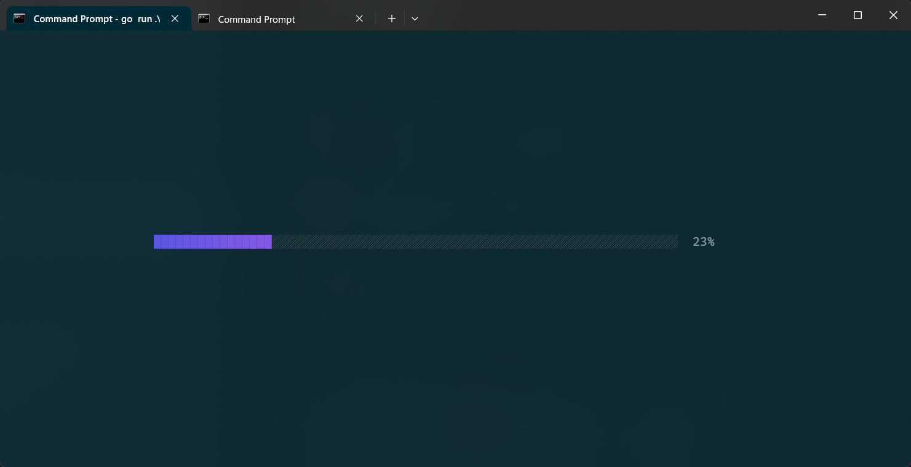

Server Menu:

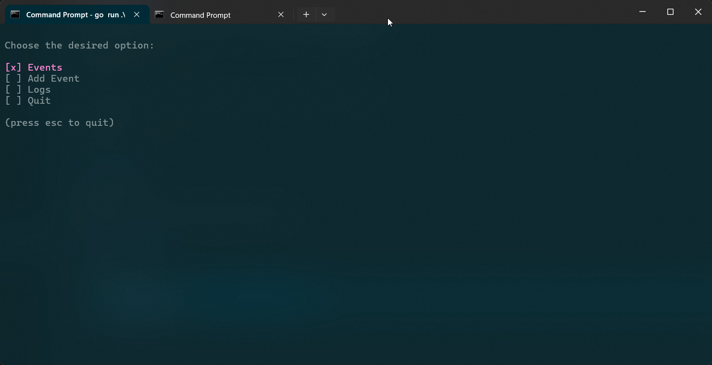

Adding Event:

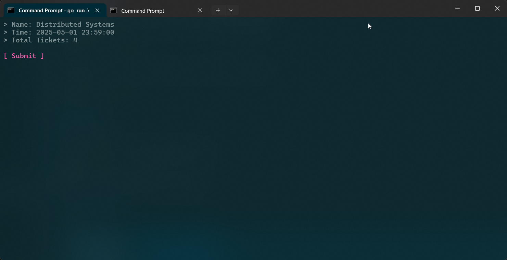

Retrieving Events in Server:

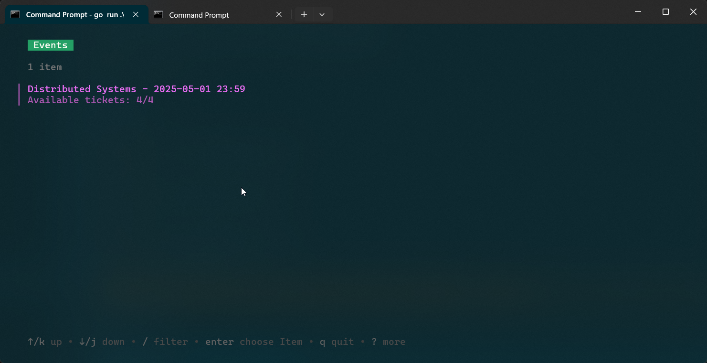

Client Menu:

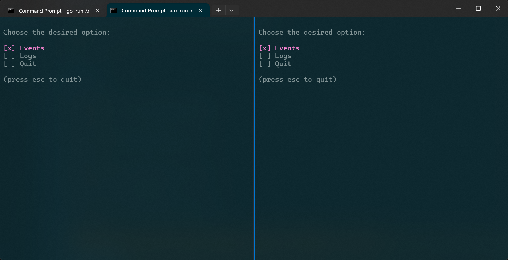

Listing Events in Client:

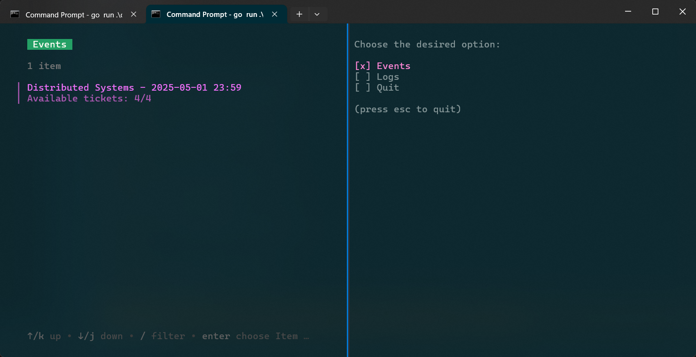

Rate Limit Exceeded (limit is 1):

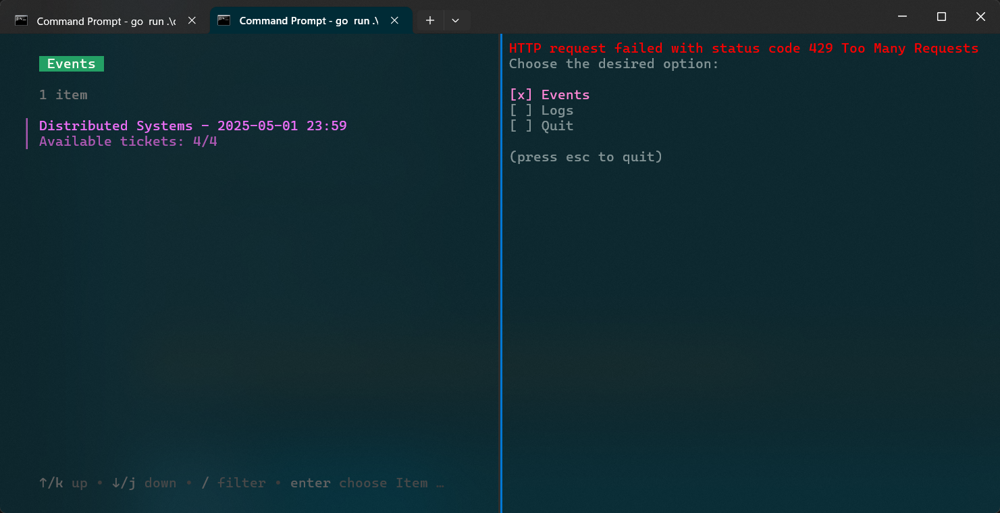

Booking Tickets:

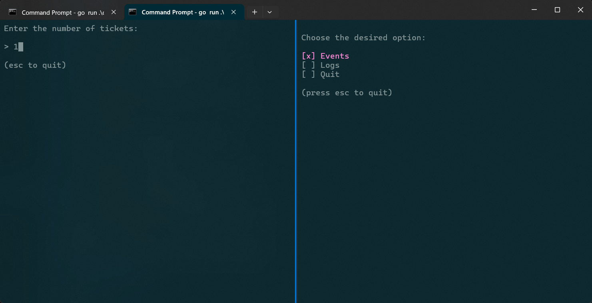

Booking Results:


Data Consistency (2 clients booking tickets concurrently):

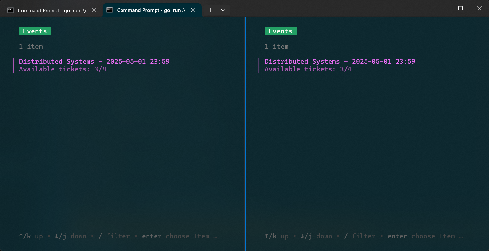
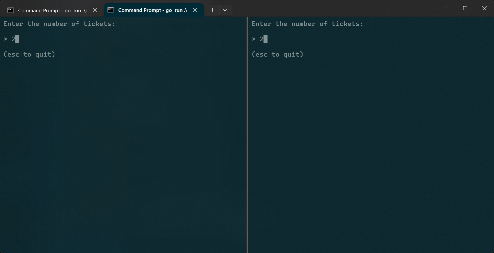
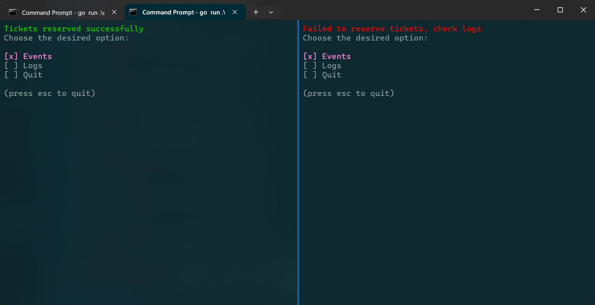
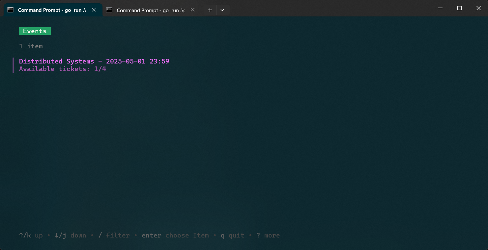

Server Logs:

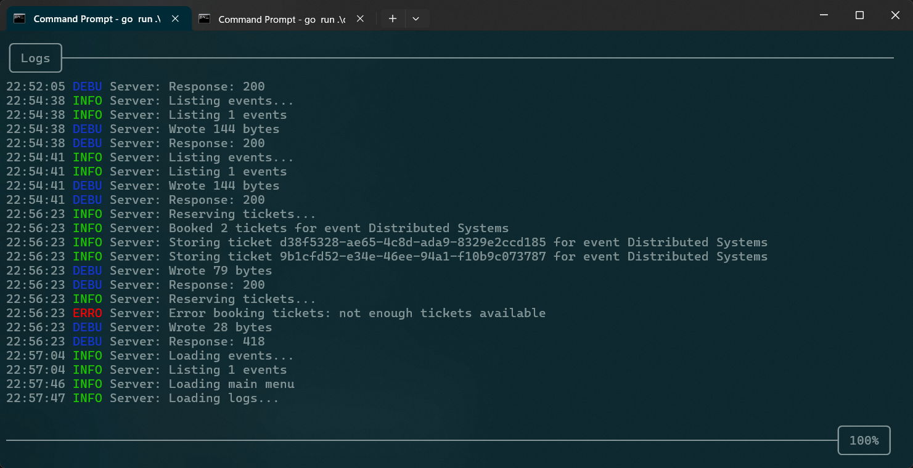

Client Logs:

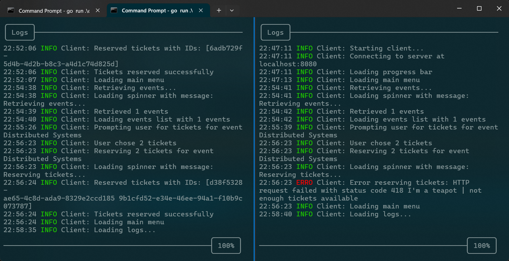

## Task Division

| Task                            | Assigned To |
| ------------------------------- | ----------- |
| Server CLI                      | Pasha       |
| Client CLI                      | Saman       |
| HTTP Server                     | Ali         |
| HTTP Client                     | Misagh      |
| Data Consistency                | Pasha       |
| Error Handling                  | Saman       |
| Logging                         | Ali         |
| Caching                         | Misagh      |
| Resource Management (Semaphore) | Saman       |
| Data Exchange Protocol          | Ali         |
| Critical Sections               | Pasha       |
| README: Data Structures         | Misagh      |
| README: Caching                 | Misagh      |
| README: Description             | Misagh      |
| README: Results                 | Misagh      |
| README: Introduction            | Pasha       |
| README: Concurrency Control     | Pasha       |
| README: Interfaces              | Pasha       |
| README: Communication Protocol  | Ali         |
| README: Reservation System      | Ali         |
| README: Resource Management     | Ali         |
| README: Fairness                | Saman       |
| README: Logging                 | Saman       |
| README: Error Handling          | Saman       |
